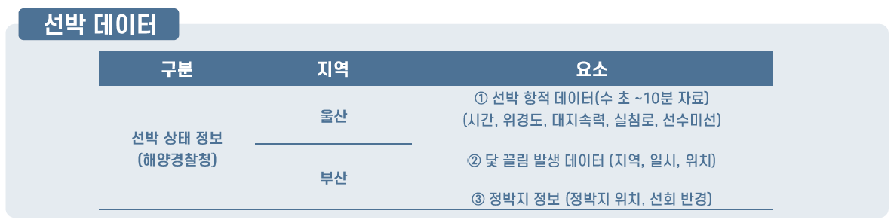
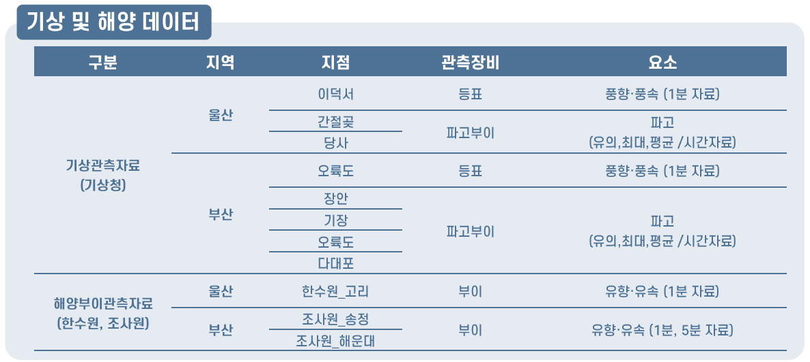
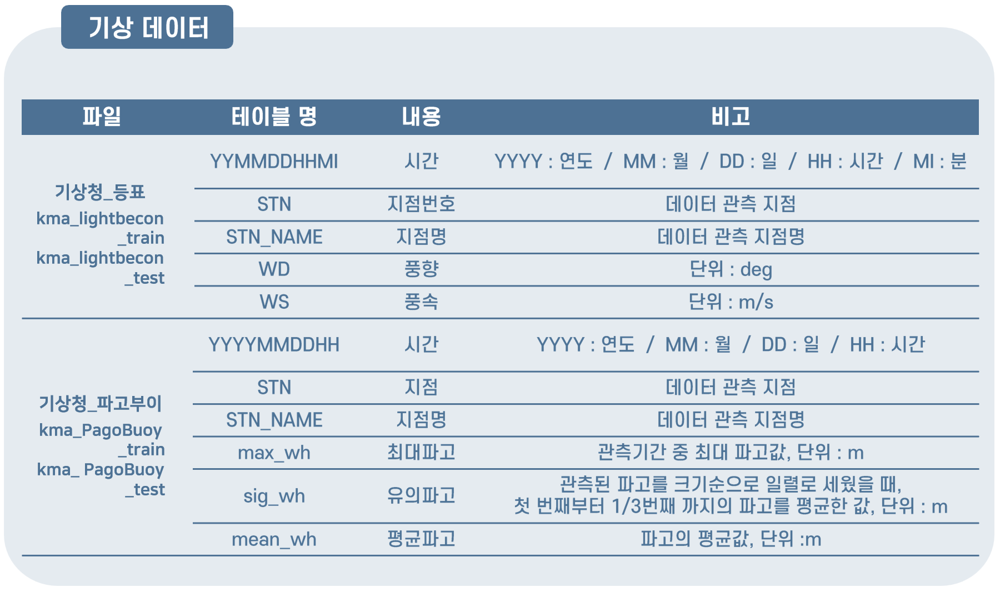
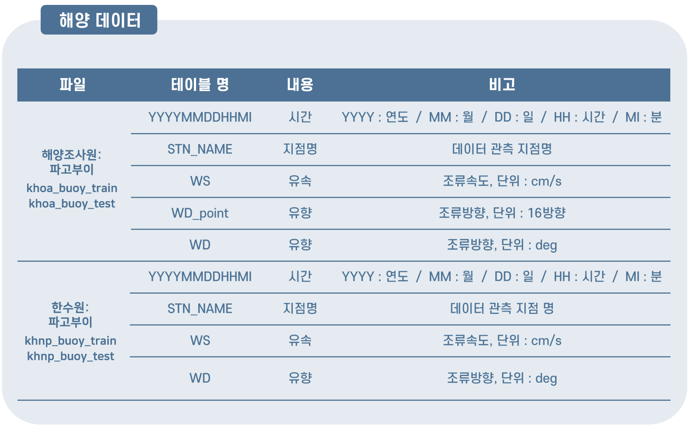
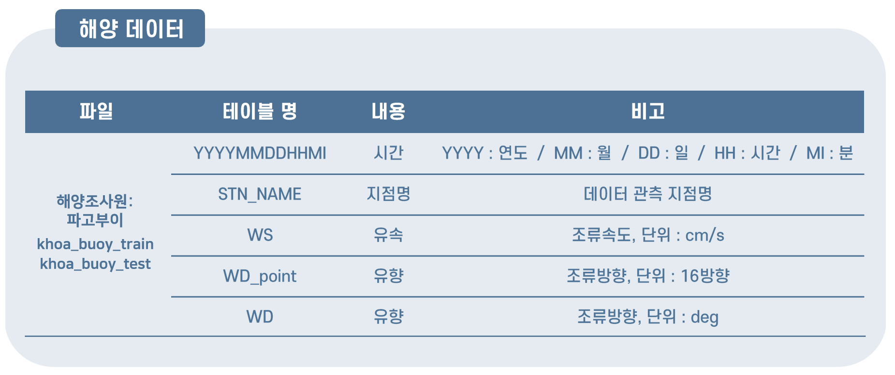
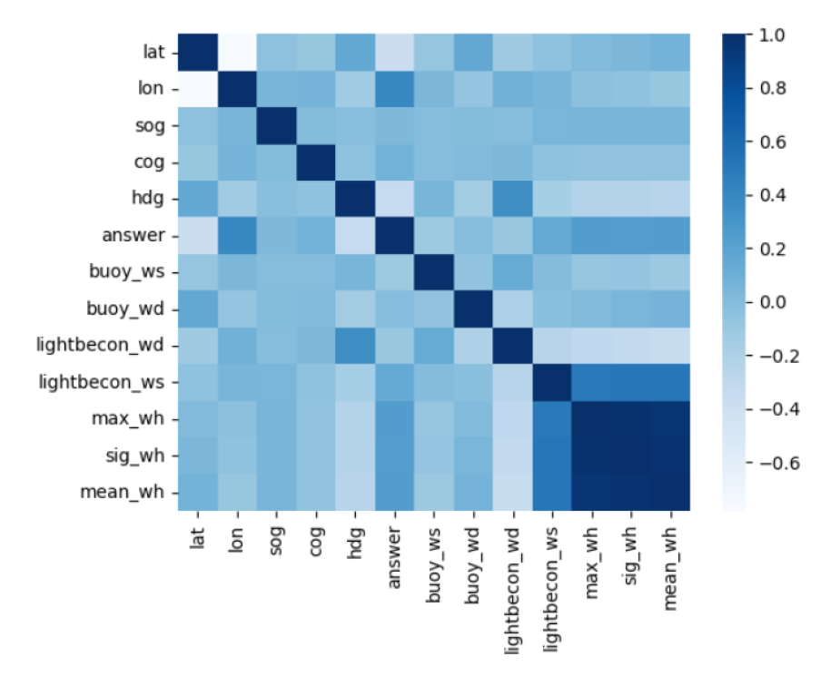
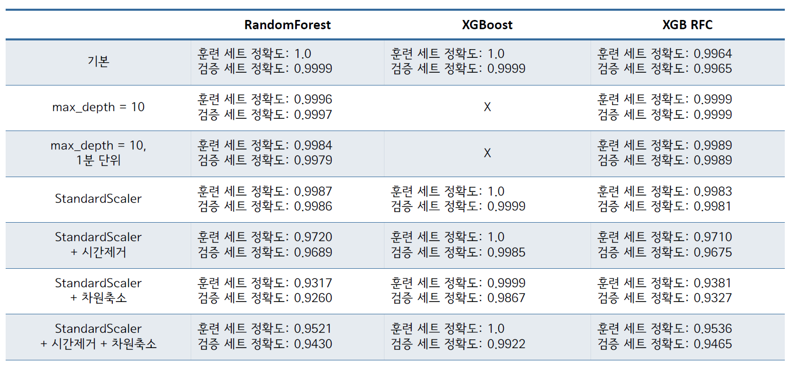
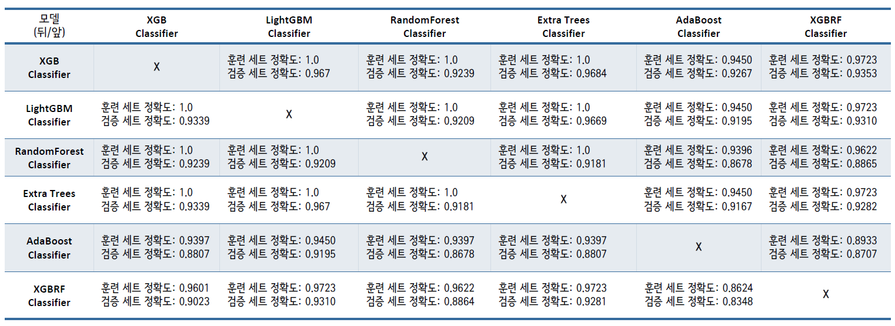

# Mini_Project (23.06.12 ~ 23.06.23)
2023 날씨 빅데이터 콘테스트 - 해양안전

<기상에 따른 선박 닻끌림 예측>

## 🖥️ 프로젝트 주제
날씨마루에서 제공하는 선박데이터와 기상·해양 데이터를 이용하여 기상 상태에 따른 닻끌림 발생 여부 분석
 

## 🕰️ 프로젝트 진행 기간
* 23.06.12일 - 23.06.23일

## 🧑‍🤝‍🧑 멤버구성
 - 팀장  : 이승윤 - 해양 조사원 해양 데이터 전처리, PPT제작, 발표
 - 팀원1 : 이지연 - 정박지 데이터 선회반경 구하고, 지도에 좌표 표시하기 
 - 팀원2 : 이창희 - 기상청 기상 데이터 전처리
 - 팀원3 : 이민재 - 선박 데이터 전처리, 앙상블 모델 설계, 하이퍼파라미터
 - 팀원4 : 심세은 - 한국수력원자력 해양 데이터 전처리, 데이터 통합, 랜덤포레스트 모델 설계 

## ⚙️ 분석 환경
- `Python`
- 'Jupyter notebook'

## 📝분석 데이터
- 날씨마루 (http://bd.kma.go.kr/) 분석환경에서 다운로드
- 학습데이터 (2021년 1월 ~ 2022년 6월), 검증데이터(2022년 7월 ~ 2023년 3월)
- 데이터 중 지역이 울산인 데이터만 분석 (차후, 부산 데이터 분석 예정)
1. 선박 데이터: 선박상태 정보(해양경찰청 제공)
2. 기상 데이터: 기상관측자료 (기상청 제공)
3. 해양 데이터: 해양부이관측자료 (해양조사원, 한국수력원자력 제공)

### 데이터 구성

### 데이터 설명

## 📌 프로젝트 진행 과정
### 1. 데이터 전처리
- 결측치 처리
- 데이터 통합
- 이상치 처리
  
### 2. 데이터 특성 간 상관관계 시각화 - Heat map

### 3. 모델링
- 사용한 모델
  - RandomForest
  - XGBoost
  - XGBRF
- 모델별 성능 비교
  

- Ensemble
  

### 4. 최종 모델 선정
- XGBRF
- HyperParameter Tunning 사용
- Standardscaler 사용
  
### 5. Feature Inportance 확인

