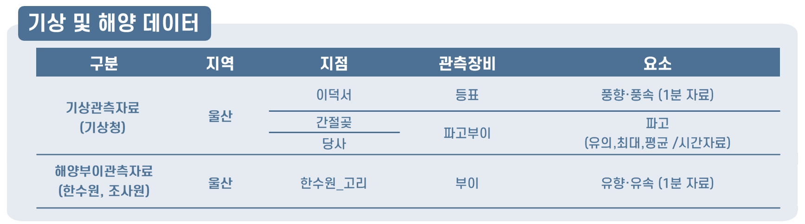

# Mini_Project (23.06.12 ~ 23.06.23)
2023 날씨 빅데이터 콘테스트 - 해양안전

<기상에 따른 선박 닻끌림 예측>

## 🖥️ 프로젝트 주제
날씨마루에서 제공하는 선박데이터와 기상·해양 데이터를 이용하여 기상 상태에 따른 닻끌림 발생 여부 분석
 

## 🕰️ 프로젝트 진행 기간
* 23.06.12일 - 23.06.23일

## 🧑‍🤝‍🧑 멤버구성
 - 팀장  : 이승윤 - 해양 조사원 해양 데이터 전처리, PPT제작, 발표
 - 팀원1 : 이지연 - 정박지 데이터 선회반경 구하고, 지도에 좌표 표시하기 
 - 팀원2 : 이창희 - 기상청 기상 데이터 전처리
 - 팀원3 : 이민재 - 선박 데이터 전처리, 앙상블 모델 설계, 하이퍼파라미터
 - 팀원4 : 심세은 - 한국수력원자력 해양 데이터 전처리, 데이터 통합, 랜덤포레스트 모델 설계 

## ⚙️ 분석 환경
- `Python`
- 'Jupyter notebook'

## 📝 분석 데이터
- 날씨마루 (http://bd.kma.go.kr/) 분석환경에서 다운로드
- 학습데이터 (2021년 1월 ~ 2022년 6월), 검증데이터(2022년 7월 ~ 2023년 3월)
- 데이터 중 지역이 울산인 데이터만 분석 (차후, 부산 데이터 분석 예정)
1. 선박 데이터: 선박상태 정보(해양경찰청 제공)
2. 기상 데이터: 기상관측자료 (기상청 제공)
3. 해양 데이터: 해양부이관측자료 (해양조사원, 한국수력원자력 제공)

### 데이터 구성

### 데이터 설명

## 📌 주요 기능
#### 로그인 - <a href="https://github.com/chaehyuenwoo/SpringBoot-Project-MEGABOX/wiki/%EC%A3%BC%EC%9A%94-%EA%B8%B0%EB%8A%A5-%EC%86%8C%EA%B0%9C(Login)" >상세보기 - WIKI 이동</a>
- DB값 검증
- ID찾기, PW찾기
- 로그인 시 쿠키(Cookie) 및 세션(Session) 생성
#### 회원가입 - <a href="https://github.com/chaehyuenwoo/SpringBoot-Project-MEGABOX/wiki/%EC%A3%BC%EC%9A%94-%EA%B8%B0%EB%8A%A5-%EC%86%8C%EA%B0%9C(Member)" >상세보기 - WIKI 이동</a>
- 주소 API 연동
- ID 중복 체크
#### 마이 페이지 - <a href="https://github.com/chaehyuenwoo/SpringBoot-Project-MEGABOX/wiki/%EC%A3%BC%EC%9A%94-%EA%B8%B0%EB%8A%A5-%EC%86%8C%EA%B0%9C(Member)" >상세보기 - WIKI 이동</a>
- 주소 API 연동
- 회원정보 변경

#### 영화 예매 - <a href="https://github.com/chaehyuenwoo/SpringBoot-Project-MEGABOX/wiki/%EC%A3%BC%EC%9A%94-%EA%B8%B0%EB%8A%A5-%EC%86%8C%EA%B0%9C(%EC%98%81%ED%99%94-%EC%98%88%EB%A7%A4)" >상세보기 - WIKI 이동</a>
- 영화 선택(날짜 지정)
- 영화관 선택(대분류/소분류 선택) 및 시간 선택
- 좌석 선택
- 결제 페이지
- 예매 완료
#### 메인 페이지 - <a href="https://github.com/chaehyuenwoo/SpringBoot-Project-MEGABOX/wiki/%EC%A3%BC%EC%9A%94-%EA%B8%B0%EB%8A%A5-%EC%86%8C%EA%B0%9C(%EB%A9%94%EC%9D%B8-Page)" >상세보기 - WIKI 이동</a>
- YouTube API 연동
- 메인 포스터(영화) 이미지 슬라이드(CSS)
#### 1대1문의 및 공지사항 - <a href="" >상세보기 - WIKI 이동</a> 
- 글 작성, 읽기, 수정, 삭제(CRUD)

#### 관리자 페이지 
- 영화관 추가(대분류, 소분류)
- 영화 추가(상영시간 및 상영관 설정)
