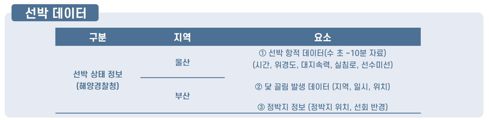
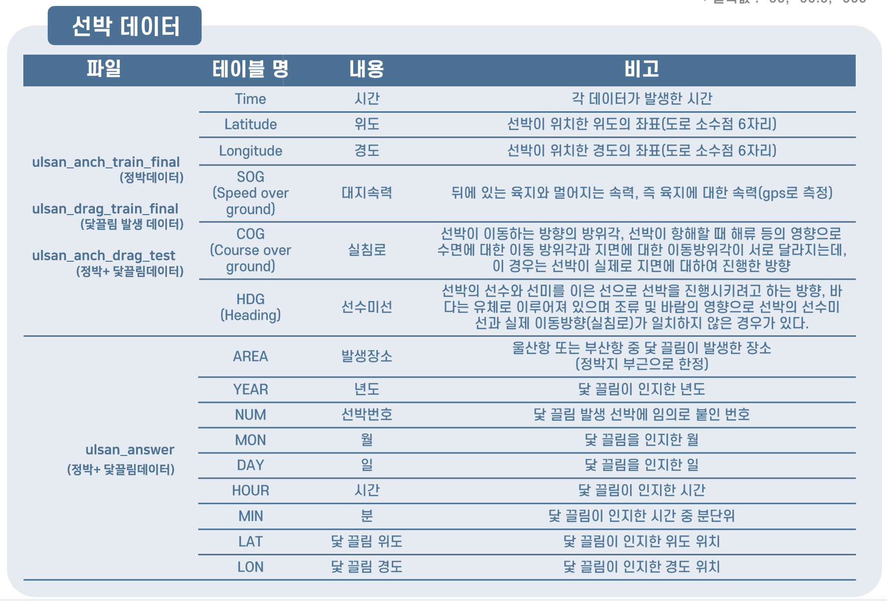

# Mini_Project (23.06.12 ~ 23.06.23)
2023 날씨 빅데이터 콘테스트 - 해양안전  
<기상에 따른 선박 닻끌림 예측>
 

## 🖥️ 프로젝트 주제
날씨마루에서 제공하는 선박데이터와 기상·해양 데이터를 이용하여 기상 상태에 따른 닻끌림 발생 여부 분석
 
 

## 🕰️ 프로젝트 진행 기간
* 23.06.12일 - 23.06.23일
 

## 🧑‍🤝‍🧑 멤버구성
 - 팀장  : 이승윤 - 해양 조사원 해양 데이터 전처리, PPT제작, 발표
 - 팀원1 : 이지연 - 정박지 데이터 선회반경 구하고, 지도에 좌표 표시하기 
 - 팀원2 : 이창희 - 기상청 기상 데이터 전처리
 - 팀원3 : 이민재 - 선박 데이터 전처리, 앙상블 모델 설계, 하이퍼파라미터
 - 팀원4 : 심세은 - 한국수력원자력 해양 데이터 전처리, 데이터 통합, 랜덤포레스트 모델 설계 
 

## ⚙️ 분석 환경
- **`Python`**
- **`Jupyter notebook`**
 

## 📝분석 데이터
- 날씨마루 (http://bd.kma.go.kr/) 분석환경에서 다운로드
- 학습데이터 (2021년 1월 ~ 2022년 6월), 검증데이터(2022년 7월 ~ 2023년 3월)
- 데이터 중 지역이 울산인 데이터만 분석 (차후, 부산 데이터 분석 예정)
1. 선박 데이터: 선박상태 정보(해양경찰청 제공)
2. 기상 데이터: 기상관측자료 (기상청 제공)
3. 해양 데이터: 해양부이관측자료 (해양조사원, 한국수력원자력 제공)
 

### 데이터 구성

 

### 데이터 설명

 

## 📌 프로젝트 진행 과정
### 1. 데이터 전처리
- **울산 데이터만 필터링**
  - 지역에 관한 컬럼이 존재하는 테이블에서 지역을 기준으로 울산 데이터만 필링
    
- **테이블 간 시간컬럼 표기 통일** 
  - 각 테이블마다 시간컬럼 표기가 달라 통일
  - `string('yyyymmddhhmm)` 형태의 시간 데이터 → `year, month, day, hour, min` 컬럼으로 분리
  - `hour`단위로 기록된 데이터를 가진 테이블, `min`단위로 기록된 데이터를 가진 테이블, 그리고 `sec`단위로 기록된 데이터를 가진 테이블이 존재함.
    
- **테이블 간 위경도 표기 통일**
  - `.lat`, `.lon`으로 위경도 컬럼 name 통일
  - `string`형태의 위경도 데이터 → `float`형태로 데이터 타입 변경
    
- **결측치(-99, -99.9, -999) 처리**
  - 선박데이터_cog컬럼: 평균값으로 대체
  - 선박데이터_hdg컬럼: 평균값으로 대체
  - 해양데이터_ws컬럼: 평균값으로 대체
  - 해양데이터_wd컬럼: hour기준 최빈값으로 대체
  - 해양데이터_wh컬럼: 평균값으로 대체

-  **방향(.wd)컬럼 표기법 변경**
   - `float`형으로 저장되어 있는 방향(.wd)컬럼을 16방위로 변경
     
     <table width=100% frame=void>
      <tr>
        <td align = 'center' width=50%>
     
      </td>
      <td align = 'center' width=50%>
         <table class="tg">
         <thead>
           <tr>
             <th class="tg-c3ow">float</th>
             <th class="tg-c3ow">16방위</th>
             <th class="tg-c3ow">인코딩</th>
           </tr>
         </thead>
         <tbody>
           <tr>
             <td class="tg-c3ow" align = "center">0 ~ 11.25</td>
             <td class="tg-c3ow" align = "center">N</td>
             <td class="tg-c3ow" align = "center">0</td>
           </tr>
           <tr>
             <td class="tg-c3ow" align = "center">11.26 ~ 33.75</td>
             <td class="tg-c3ow" align = "center">NNE</td>
             <td class="tg-c3ow" align = "center">1</td>
           </tr>
           <tr>
             <td class="tg-c3ow" align = "center">33.76 ~ 56.25</td>
             <td class="tg-c3ow" align = "center">NE</td>
             <td class="tg-c3ow" align = "center">2</td>
           </tr>
           <tr>
             <td class="tg-c3ow" align = "center">56.26 ~ 78.75</td>
             <td class="tg-c3ow" align = "center">ENE</td>
             <td class="tg-c3ow" align = "center">3</td>
           </tr>
           <tr>
             <td class="tg-c3ow" align = "center">78.76 ~ 101.25</td>
             <td class="tg-c3ow" align = "center">E</td>
             <td class="tg-c3ow" align = "center">4</td>
           </tr>
           <tr>
             <td class="tg-c3ow" align = "center">101.26 ~ 123.75</td>
             <td class="tg-c3ow" align = "center">ESE</td>
             <td class="tg-c3ow" align = "center">5</td>
           </tr>
           <tr>
             <td class="tg-c3ow" align = "center">123.76 ~ 146.25</td>
             <td class="tg-c3ow" align = "center">SE</td>
             <td class="tg-c3ow" align = "center">6</td>
           </tr>
           <tr>
             <td class="tg-c3ow" align = "center">146.26 ~ 168.75</td>
             <td class="tg-c3ow" align = "center">SSE</td>
             <td class="tg-c3ow" align = "center">7</td>
           </tr>
           <tr>
             <td class="tg-c3ow" align = "center">168.76 ~ 191.25</td>
             <td class="tg-c3ow" align = "center">S</td>
             <td class="tg-c3ow" align = "center">8</td>
           </tr>
           <tr>
             <td class="tg-c3ow" align = "center">191.26 ~ 213.75</td>
             <td class="tg-c3ow" align = "center">SSW</td>
             <td class="tg-c3ow" align = "center">9</td>
           </tr>
           <tr>
             <td class="tg-c3ow" align = "center">213.76 ~ 236.25</td>
             <td class="tg-c3ow" align = "center">SW</td>
             <td class="tg-c3ow" align = "center">10</td>
           </tr>
           <tr>
             <td class="tg-c3ow" align = "center">236.26 ~ 258.75</td>
             <td class="tg-c3ow" align = "center">WSW</td>
             <td class="tg-c3ow" align = "center">11</td>
           </tr>
           <tr>
             <td class="tg-c3ow" align = "center">258.76 ~ 281.25</td>
             <td class="tg-c3ow" align = "center">W</td>
             <td class="tg-c3ow" align = "center">12</td>
           </tr>
           <tr>
             <td class="tg-c3ow" align = "center">281.26 ~ 303.75</td>
             <td class="tg-c3ow" align = "center">WNW</td>
             <td class="tg-c3ow" align = "center">13</td>
           </tr>
           <tr>
             <td class="tg-c3ow" align = "center">303.76 ~ 326.25</td>
             <td class="tg-c3ow" align = "center">NW</td>
             <td class="tg-c3ow" align = "center">14</td>
           </tr>
           <tr>
             <td class="tg-c3ow" align = "center">326.26 ~ 348.75</td>
             <td class="tg-c3ow" align = "center">NNW</td>
             <td class="tg-c3ow" align = "center">15</td>
           </tr>
           <tr>
             <td class="tg-c3ow" align = "center">348.76 ~ 360</td>
             <td class="tg-c3ow" align = "center">N</td>
             <td class="tg-c3ow" align = "center">0</td>
           </tr>
           <tr>
              <td class="tg-c3ow" align = "center">결측값</td>
              <td class="tg-c3ow" align = "center">X</td>
              <td class="tg-c3ow" align = "center">16</td>
            </tr>
         </tbody>
         </table>
         </td>
      </tr>
     </table>

- **데이터 통합**
  - 선박데이터의 시간 컬럼을 기준으로 나머지 기상데이터, 해양데이터 통합하여 하나의 테이블로 만듦. ⇒ `df_train.csv`, `df_test.csv`
  - 선박데이터의 시간에 대한 기상·해양 데이터가 없는 경우에 대해 2가지 방법으로 처리
    - 기상·해양 데이터를 평균 및 최빈값으로 대체 ⇒ `df_train_v2_mean.csv`, `df_test_v2_mean.csv`
    - 해당 row 삭제 ⇒ `df_train_v2.csv`, `df_test_v2.csv`
     
- **이상치 처리**
  - 각각의 컬럼에 대해 boxplot을 그려 이상치 확인 후, 이상치 데이터를 가진 row 삭제
    

### 2. 데이터 분포 시각화 - geoplot
- 정박된 선박의 위경도를 활용하여 선박의 위치 지도에 표시
  

  
  
  

  

### 3. 데이터 특성 간 상관관계 시각화 - Heat map

### 4. 모델링
- **사용한 모델**
  

  
<b>RandomForest</b>

  
       

  - 데이터셋의 여러 하위 샘플에 대해 여러 개의 결정 트리 분류기를 학습시키고 평균화하여 예측 정확도를 향상시키고 과적합을 제어.
  - 장점  
    - 예측의 변동성이 줄어들며, 과적합을 방지  
    - 결측치에 대해 강함  
    - 결측치의 비율이 높아져도 높은 정확도를 나타냄  
    - 변수의 중요성을 파악할 수 있음
  - 단점  
    - 데이터의 수가 많아지면 의사 결정나무에 비해 속도가 크게 떨어짐  
    - 결과에 대한 해석이 어려운 단점이 있음  

  

  

  

  
<b>XGBoost</b>

  
       

  - 결정트리(Decision Tree) 알고리즘 기반 부스팅 앙상블 기법의 한 종류  
  - 이전 모델의 오류를 순차적으로 보완해나가는 방식으로 모델을 형성  
  - 이전 모델에서의 실제값과 예측값의 오차(loss)를 훈련데이터에 투입하고 gradient를 이용하여 오류를 보완하는 방식을 사용함  

  

  

  

  
<b>XGBRF</b>

  
       

  - XGBoost(Extreme Gradient Boosting)의 랜덤 포레스트 버전
  - 약한 학습기인 결정 트리들을 조합하여 강한 학습기를 구성하는 분류 알고리즘
  - XGBRF는 XGBoost의 특징과 장점을 가지고 있으며, 랜덤 포레스트의 장점인 안정성과 과적합 방지 효과를 제공
  - 분류 작업에서 최적의 예측 모델을 생성하기 위해 XGBRF는 약한 학습기인 결정 트리를 학습하고, 이들을 조합하여 강한 학습기를 구성
  - XGBRF는 부스팅(Boosting) 알고리즘으로, 이전 약한 학습기의 오차를 보완하도록 다음 약한 학습기를 학습

  

  

 
- **모델별 성능 비교**
  

- **앙상블**
  

 

### 5. 최종 모델 선정
- XGBRF
- HyperParameter Tunning 사용
  |parameter|parameter description|value|
  |:---------:|:---------------------:|:-----:|
  |`n_estimatiors`|트리 개수 지정|`263`|
  |`max_depth`|각 트리의 최대 깊이 지정|`9`|
  |`learning_rate`|각 트리의 가중치 업데이트에 대한 학습 속도 지정|`0.038`|
  |`subsample`|각 트리를 훈련할 때 사용할 샘플의 비율 지정|`0.5305`|
  |`colsample_bynode`|각 분할에서 사용할 피처의 비율 지정|`0.6650`|
  |`reg_alpha`|L1 정규화 항에 대한 가중치 지정|`0.081`|
  |`reg_lambda`|L2 정규화 항에 대한 가중치 지정|`0.8736`|
  |`min_child_weight`|리프 노드를 분할하기 위한 최소 가중치 합 지정|`9`|
  |`gamma`|리프 노드의 손실 감소에 필요한 최소 손실 감소 값 지정|`0.3216`|
  |`scale_pos_weight`|양성 클래스의 가중치 지정|`0.9209`|
  
- Standardscaler 사용
 

### 6. Feature Inportance 확인

